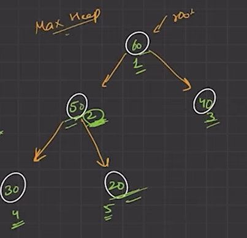

# Heap
Heap is a data structrue which is a complete binary tree tha comes with a heap order property

**Complete Binary Tree** : All level filled except the last level, node always fills from left

**Max Heap** : Child value always smaller than Parent

**Min Heap** : Child value always bigger than Parent

Representing Heap in Array with startign from 1st index : [_, 60, 50, 40, 30, 20]


**One based Indexing**:
Parent : ith index
Left Child : 2*i th index
Right Child  : 2*i+1 th index
Parent Node : i/2

**Zero based Indexing**:
Left Child : 2*i+1 th index
Right Child  : 2*i+2 th index
Parent Node : (i-1)/2
 

### Insertion in heap (max-heap)
- insert at last index
- compare with parent : i/2 index, if parent smaller than current node then swap till satisfy max heap
- Time Complexity : O(logn)

```cpp
#include <bits/stdc++.h>
using namespace std;

class Heap{
    public:
        int arr[100];
        int size;

    Heap(){
        size = 0;
    }

    void insert(int val){
        size+=1;
        arr[size]=val;
        int index = size;

        while(index>1){
            int parentInd = index/2;

            if(arr[parentInd]>arr[index]){
                return;
            }
            swap(arr[parentInd], arr[index]);
            index/=2;
        }
    }

    void print(){
        for(int i=1; i<=size; i++){
            cout<<arr[i]<<" ";
        }
        cout<<endl;
    }
};

int main() {
	// your code goes here
    Heap heap;
    
    heap.insert(70);
    heap.insert(50);
    heap.insert(40);
    heap.insert(30);
    heap.insert(20);
    heap.print();
    
    heap.insert(65);
    heap.print();
}
```

### Deletion in heap (max-heap)
- put last element into first
- remove last element
- place root element to its correct position

```cpp
// delte the root node
void deleteFromHeap(){
    if(size==0) return ;
    
    // step 1 : put last elm in root
    arr[1] = arr[size];
    
    // step 2: remove last node
    size--;
    
    // step 3: correct the position of root node
    // max heap : means parent should be greater than child
    int i=1;
    while(i<size){
        if(2*i<size && arr[i]<arr[2*i]){
            swap(arr[i], arr[2*i]);
            i = 2*i;
        }
        else if(2*i+1 < size && arr[i]<arr[2*i+1]){
            swap(arr[i], arr[2*i+1]);
            i = 2*i+1;
        }
        else{
            return;
        }
    }
}
```

### Heapify (max-heap)
- check child smaller than parent or not, if not then swap
- apply heapify() further
- time complexity : O(logn)

```cpp
void heapify(int arr[], int n, int i){
    int largest = i;
    int left = 2*i;
    int right = left + 1;
    
    if(left<=n && arr[largest]<arr[left]){
        largest = left;
    }
    if(right<=n && arr[largest]<arr[right]){
        largest = right;
    }
    
    if(largest!=i){
        swap(arr[largest], arr[i]);
        heapify(arr, n, largest);
    }
}
```

### Build Heap (max-heap)
- leaf elements are : [ n/2+1 to n ]
- leaf elements are already satisfy heap property
- heapify() for element : n/2 to 1
- time complexity  : O(n)   // how? 

- Insert n element to heap : O(nlogn)
- Build heap with n element : O(n) not O(nlogn)

```cpp
int arr[] = {-1, 55, 54, 50, 52, 53};   // size = 5
int n = 5;
for(int i=n/2; i>0; i--){
    heapify(arr, n, i);
}
```

### Build Min-Heap
```cpp
// Zero based indexing
#include <bits/stdc++.h> 
void heapify(vector<int> &arr, int n, int i){
    int smallest = i;
    int left = 2*i+1;
    int right = 2*i+2;

    if(left<n && arr[smallest]>arr[left]){
        smallest = left;
    }

    if(right<n && arr[smallest]>arr[right]){
        smallest = right;
    }

    if(smallest!=i){
        swap(arr[i], arr[smallest]);
        heapify(arr, n, smallest);
    }
}
vector<int> buildMinHeap(vector<int> &arr)
{
    int n = arr.size();
    for(int i=n/2-1; i>=0; i--){
        heapify(arr,n,i);
    }

    return arr;
}
```

## STL for heap (priority_queue)
- Insert : pq.push()
- Top    : pq.top()
- Delete : pq.pop()
- Size   : pq.size()
- Empty  : pq.empty()
```cpp
#include<queue>

int main(){
    priority_queue<int> maxHeap;

    priority_queue<int, vector<int>, greater<int>> minHeap;
}
```
